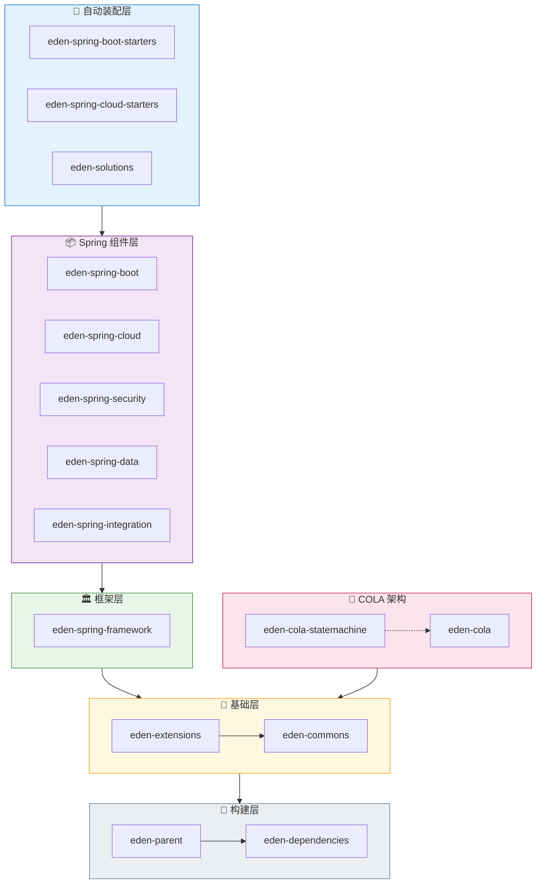

# Eden* Architect

[](https://github.com/shiyindaxiaojie/eden-architect)
[](https://github.com/shiyindaxiaojie/eden-architect/actions)
[](https://www.apache.org/licenses/LICENSE-2.0.html)
[](https://sonarcloud.io/dashboard?id=shiyindaxiaojie_eden-architect)

<p>
  <strong>🚀 企业级分布式应用一站式解决方案</strong>
</p>

简体中文 | [English](./README.md)

---

## 📖 简介

**Eden* Architect** 致力于为企业开发提供一站式的解决方案。它封装了构建分布式应用服务所需的各类必选组件。您只需要简单的注解和少量的配置，即可将 Spring Boot 应用接入微服务生态，并利用我们强大的中间件能力迅速搭建稳定可靠的分布式系统。

## 📚 文档

- [中文文档](./docs/zh-CN/README.md) - 组件集成指南
- [English Documentation](./docs/en/README.md) - Component Integration Guides

## ✨ 功能特性

| 特性 | 说明 |
|------|------|
| 📦 **统一依赖管理** | 集中管理依赖版本，彻底解决依赖冲突；封装常用插件，显著减少构建时间 |
| 🛠️ **组件深度集成** | 在 Spring 官方基础上扩展，开箱即用集成 `XxlJob`、`CAT`、`Netty`、`Arthas` 等主流组件 |
| 🔌 **灵活扩展点** | 针对消息队列、缓存、短信、邮件、Excel 等技术提供高度抽象的扩展接口，支持动态适配 |
| 💡 **通用解决方案** | 提供`多级缓存`、`分布式锁`、`分布式唯一ID`、`幂等性`、`审计日志`、`最终一致性`、`全链路追踪`等企业级解决方案 |

## 🏗️ 架构概览



### 组件说明

| 组件 | 说明 |
|------|------|
| **eden-dependencies** | 依赖管理组件，统一管控全局依赖版本 |
| **eden-parent** | 构建管理组件，封装常用插件，提供开箱即用的构建配置 |
| **eden-commons** | 基础工具组件，扩展了 `Apache Commons` 和 `Google Guava` |
| **eden-extensions** | 扩展点组件，参考 `Dubbo` SPI 机制实现的轻量级扩展框架 |
| **eden-cola** | 优化版 `COLA` 组件，完善了 DDD 领域模型、状态机及业务扩展点支持 |
| **eden-solutions** | 解决方案工具集，涵盖 `缓存`、`锁`、`去重`、`审计` 等场景实现 |
| **eden-spring-framework** | 基础框架组件，支持自定义错误码及异常解析机制 |
| **eden-spring-data** | 数据存储扩展，支持 `Mybatis`、`Redis`、`Flyway`、`Liquibase` 等 |
| **eden-spring-security** | 安全认证扩展，支持 `OAuth2`、`Jwt`、`Shiro` 等 |
| **eden-spring-integration** | 第三方集成扩展，支持 `RocketMQ`、`Kafka`、`Netty`、`XxlJob` |
| **eden-spring-cloud** | 微服务组件扩展，支持 `Nacos`、`Sentinel`、`Zookeeper` 等 |

## 🚀 快速开始

### 环境准备

### 代码构建

```bash
git clone https://github.com/shiyindaxiaojie/eden-architect.git
cd eden-architect
./mvnw install -T 4C
```

### 项目集成

**1. 引入父工程**

```xml
<parent>
    <groupId>io.github.shiyindaxiaojie</groupId>
    <artifactId>eden-parent</artifactId>
    <version>0.0.1-SNAPSHOT</version>
    <relativePath/>
</parent>
```

**2. 添加依赖**

以 CAT 为例。

```xml
<dependency>
    <groupId>io.github.shiyindaxiaojie</groupId>
    <artifactId>eden-cat-spring-boot-starter</artifactId>
</dependency>
```

> 版本号由 `eden-parent` 统一管理，无需手动指定。

**3. 配置参数**

```yaml
cat:
  enabled: true
  trace-mode: true
  servers: localhost
```

**4. 启动运行**

启动应用后，发起 HTTP 请求，即可在 CAT 控制台查看全链路追踪数据。

## 🧩 示例项目

| 项目 | 架构风格 | 说明 |
|------|----------|------|
| [eden-demo-cola](https://github.com/shiyindaxiaojie/eden-demo-cola) | COLA 架构 | 面向领域模型，适合复杂业务 |
| [eden-demo-layer](https://github.com/shiyindaxiaojie/eden-demo-layer) | 分层架构 | 传统面向数据模型 |
| [eden-demo-mvc](https://github.com/shiyindaxiaojie/eden-demo-mvc) | MVC 架构 | 简单单体应用 |

## 🔧 最佳实践

### CAT 可观测性方案

通过 `TraceId` 分析整个链路的 `HTTP` 请求耗时、`RPC` 调用情况、`Log` 业务日志、`SQL` 和 `Cache` 执行耗时。[传送锚点](https://github.com/shiyindaxiaojie/cat)


### Sentinel 流量治理方案

根据业务负载配置您的流控规则，并允许在任意时刻查看接口的 QPS 和限流情况。[传送锚点](https://github.com/shiyindaxiaojie/Sentinel)


### Arthas 在线诊断工具

使用动态时运行探针，自动发现服务，开箱即用，允许在低负载环境诊断你的应用。[传送锚点](https://github.com/shiyindaxiaojie/arthas)


## 版本规范

项目的版本号格式为 `x.y.z` 的形式，其中 x 的数值类型为数字，从 0 开始取值，且不限于 0~9 这个范围。项目处于孵化器阶段时，第一位版本号固定使用 0，即版本号为 `0.x.x` 的格式。

* 孵化版本：0.0.1-SNAPSHOT
* 开发版本：1.0.0-SNAPSHOT
* 发布版本：1.0.0

版本迭代规则：

* 1.0.0 <> 1.0.1：兼容
* 1.0.0 <> 1.1.0：基本兼容
* 1.0.0 <> 2.0.0：不兼容

## 分支管理

由于 `Spring Boot 2.4.x` 和 `Spring Boot 3.0.x` 在架构层面有很大的变更，因此笔者采取跟 Spring Boot 版本号一致的分支:

* 2.4.x 分支适用于 `Spring Boot 2.4.x`，最低支持 JDK 8。
* 2.7.x 分支适用于 `Spring Boot 2.7.x`，最低支持 JDK 11。
* 3.5.x 分支适用于 `Spring Boot 3.5.x`，最低支持 JDK 17。
* 4.0.x 分支适用于 `Spring Boot 4.0.x`，最低支持 JDK 17。
## 📝 变更日志

详细变更记录请参阅 [CHANGELOG.md](https://github.com/shiyindaxiaojie/eden-architect/blob/main/CHANGELOG.md)。

## 📄 开源协议

本项目采用 [Apache-2.0 License](https://www.apache.org/licenses/LICENSE-2.0.html) 协议开源。