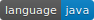
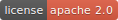

= Eden* Spring Boot

image:https://github.com/eden-lab/eden-spring-boot/workflows/build/badge.svg["Github Actions",link="https://github.com/eden-lab/eden-spring-boot/actions"]
image:https://sonarcloud.io/api/project_badges/measure?project=eden-lab_eden-spring-boot&metric=alert_status["SonarCloud", link="https://sonarcloud.io/dashboard?id=eden-lab_eden-spring-boot"]

Eden* Spring Boot 是一组基于 Spring 体系的增强式框架，在官方各组件实现的基础上进行简化和扩展，消除样板代码和简化配置，开箱即用，降低初学者的使用门槛。

您可以通过 Eden* Spring Boot 创建独立的 Java 应用程序，使用 `java -jar` 或更传统的 WAR 部署来启动它。

WARNING: 为了兼容 JDK 1.7 的版本，Eden* Spring Boot 使用的 Spring Boot 是 1.4.7 版本，如果需要升级较高的版本，请根据 Spring 官方的 API 变化进行改造。

== 基本介绍
1. 自动化配置优先，组件的集成配置只需要引入指定的 starter 即可，你也可以按自己的需求去覆盖默认的配置；
2. 统一的依赖和插件管理，解决了大量的依赖冲突，简化 POM 文件的配置工作；
3. 完善的微服务体系框架，基于服务发现覆盖单机配置，增强网关的认证口令传输；
4. 认证授权流程开箱即用，如 OAuth2、Jwt、Shiro 等安全框架；
5. 常用组件的自动化配置，如 Swagger、Metrics、Logstash、HazelCast 等等；
6. 通用的工具库积累，并对 Apache Commons 和 Google Guava 等工具类进行适配封装；
7. 丰富的组件测试框架，允许在测试的生命周期启动嵌入式的 Redis、Kafka、MongoDB 等中间件执行测试。

== 安装入门

=== 构建源码

Eden* Spring Boot 的源码支持在 JDK 1.7 以上的版本编译构建。

CAUTION: 以下情况需要在 JDK 1.8 以上的版本运行：运行 liquibase-maven-plugin 插件执行性能测试；
使用 swagger2markup-maven-plugin 插件生成接口文档；集成 zipkin 依赖组件。

您可以使用以下命令构建并发布到本地的 Maven 仓库中：

[indent=0]
----

$ ./mvnw clean install

----

发布完成后，您可以开始集成组件和配置到应用程序中，后面的内容以 Swagger2 的集成过程为例。

=== 引入依赖

从 eden-spring-boot-starters 中选择您需要的组件，以依赖引入的形式添加到应用程序的 POM 文件。此处已完成配置 Swagger2 的工作。

[source,xml,indent=0]
----
<?xml version="1.0" encoding="UTF-8"?>
<project xmlns="http://maven.apache.org/POM/4.0.0" xmlns:xsi="http://www.w3.org/2001/XMLSchema-instance"
         xsi:schemaLocation="http://maven.apache.org/POM/4.0.0 http://maven.apache.org/xsd/maven-4.0.0.xsd">

    <modelVersion>4.0.0</modelVersion>
    <packaging>war</packaging>
    <groupId>org.ylzl</groupId>
    <artifactId>eden-sample</artifactId>
    <version>0.0.1-SNAPSHOT</version>
    <name>sample</name>
    <description>Eden* Sample</description>

    <!-- 继承 Eden* Spring Boot 依赖 -->
    <parent>
        <groupId>org.ylzl</groupId>
        <artifactId>eden-spring-boot-parent</artifactId>
        <version>1.0.0.RELEASE</version>
        <relativePath/>
    </parent>

    <dependencies>
        <!-- 从 eden-spring-boot-starters 引入 Swagger2 依赖 -->
        <dependency>
            <groupId>org.ylzl</groupId>
            <artifactId>eden-swagger2-spring-boot-starter</artifactId>
        </dependency>
    </dependencies>
</project>
----

=== 微调配置

Eden* Spring Boot 提供了自动化配置和默认的配置值，当然，您可以参考下述代码在应用配置属性文件中覆盖它。

[source,yaml,indent=0]
----
eden:
    integration:
        swagger:
            default-include-pattern: /api/.* # 配置 Swagger 注解扫描的路径
----

=== 启动代码

请参考 Spring Boot 的启动示例。

[source,java,indent=0]
----

import org.springframework.boot.*;
import org.springframework.boot.autoconfigure.*;
import org.springframework.web.bind.annotation.*;

@RestController
@SpringBootApplication
public class Example {

    @RequestMapping("/")
    public String home() {
        return "Hello World!";
    }

    public static void main(String[] args) {
        SpringApplication.run(Example.class, args);
    }
}

----

== 体系结构

=== 模块清单

|===
| 应用名称 | 描述 | 技术栈

| eden-spring-boot-project
| 开发程序集
| -

| eden-spring-boot-cloud
| 微服务框架
| Spring Cloud Config、Eureka、Consul...

| eden-spring-boot-commons
| 工具类库
| Apache Commons、Googla Guava...

| eden-spring-boot-data
| 数据仓库
| Spring Data、Flyway、Liquibase、Mongobee

| eden-spring-boot-dependencies
| 依赖管理
| -

| eden-spring-boot-framework
| 基础框架
| HttpClient...

| eden-spring-boot-integration
| 组件集成
| Hazelcast、Kafka、Logstash、Metrics、Netty、Swagger...

| eden-spring-boot-parent
| 构建管理
| -

| eden-spring-boot-security
| 安全认证
| Spring Security OAuth2、Jwt...

| eden-spring-boot-starters
| 依赖集
| -

| eden-spring-boot-support
| 帮助支持
| -

| eden-spring-boot-test
| 测试框架
| -

| eden-spring-boot-tests
| 测试程序集
| -

| eden-spring-boot-deployment-tests
| 部署测试集
| -

| eden-spring-boot-integration-tests
| 集成测试集
| -

| eden-spring-boot-smoke-tests
| 冒烟测试集
| -
|===

=== 开发视图

image:src/docs/staruml/html-docs/diagrams/d5507f74c7649420f3e80c315002ce65.svg[width="600"]

== 许可声明

<<<<<<< HEAD
遵循 https://www.apache.org/licenses/LICENSE-2.0.html[Apache 2.0 License]
=======
Eden* Spring Boot 为本人在工作之余开发而成，遵循
https://www.apache.org/licenses/LICENSE-2.0.html[Apache 2.0 License]
>>>>>>> aa88219963fd30fa32e95b7854717e8ae35c979d
