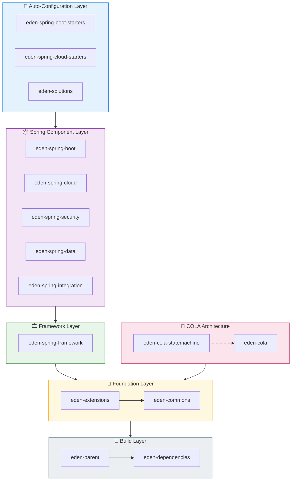

# Eden* Architect

[](https://github.com/shiyindaxiaojie/eden-architect)
[](https://github.com/shiyindaxiaojie/eden-architect/actions)
[](https://www.apache.org/licenses/LICENSE-2.0.html)
[](https://sonarcloud.io/dashboard?id=shiyindaxiaojie_eden-architect)

<p>
  <strong>🚀 A One-Stop Solution for Enterprise Distributed Applications</strong>
</p>

English | [简体中文](./README-zh-CN.md)

---

## 📖 Introduction

**Eden* Architect** is dedicated to providing a comprehensive solution for enterprise-level development. It encapsulates the essential components for building distributed application services. By simply adding a few annotations and minimal configuration, you can integrate Spring Boot applications into a microservices ecosystem and rapidly build distributed systems using our robust middleware capabilities.

## 📚 Documentation

- [English Documentation](./docs/en/README.md) - Component Integration Guides
- [中文文档](./docs/zh-CN/README.md) - 组件集成指南

## ✨ Key Features

| Feature | Description |
|---------|-------------|
| 📦 **Unified Dependency Management** | Centralized version management to resolve conflicts; encapsulated plugins to reduce build time |
| 🛠️ **Deep Component Integration** | Spring-based extensions with out-of-the-box integration for `XxlJob`, `CAT`, `Netty`, `Arthas` |
| 🔌 **Flexible Extension Points** | High-level abstractions for MQ, Cache, SMS, Email, Excel with dynamic adaptation |
| 💡 **Enterprise Solutions** | `Multi-level Cache`, `Distributed Lock`, `Unique ID`, `Idempotency`, `Audit Log`, `Eventual Consistency`, `Full-link Tracing` |

## 🏗️ Architecture Overview



### Component Overview

| Component | Description |
|-----------|-------------|
| **eden-dependencies** | Manages global dependency versions |
| **eden-parent** | Build management with common plugins and out-of-the-box configuration |
| **eden-commons** | Basic utilities extending `Apache Commons` and `Google Guava` |
| **eden-extensions** | Lightweight extension framework inspired by `Dubbo` SPI |
| **eden-cola** | Optimized `COLA` component with DDD models, state machines, and business extensions |
| **eden-solutions** | Solution toolkit for `Caching`, `Locks`, `Deduplication`, `Auditing` |
| **eden-spring-framework** | Base framework supporting custom error codes and exception resolvers |
| **eden-spring-data** | Data storage extensions for `Mybatis`, `Redis`, `Flyway`, `Liquibase` |
| **eden-spring-security** | Auth extensions for `OAuth2`, `Jwt`, `Shiro` |
| **eden-spring-integration** | Integration with `RocketMQ`, `Kafka`, `Netty`, `XxlJob` |
| **eden-spring-cloud** | Cloud extensions for `Nacos`, `Sentinel`, `Zookeeper` |

## 🚀 Getting Started

### Prerequisites

Since `Spring Boot 2.4.x` and `3.0.x` vary significantly, we maintain matching branches:

| Branch | Spring Boot | JDK |
|--------|-------------|-----|
| 2.4.x | 2.4.x | 8+ |
| 2.7.x | 2.7.x | 11+ |
| 3.0.x | 3.0.x | 17+ |

### Installation

```bash
git clone https://github.com/shiyindaxiaojie/eden-architect.git
cd eden-architect
./mvnw install -T 4C
```

### Usage

**1. Add Parent POM**

```xml
<parent>
    <groupId>io.github.shiyindaxiaojie</groupId>
    <artifactId>eden-parent</artifactId>
    <version>0.0.1-SNAPSHOT</version>
    <relativePath/>
</parent>
```

**2. Add Dependencies**

```xml
<dependency>
    <groupId>io.github.shiyindaxiaojie</groupId>
    <artifactId>eden-cat-spring-boot-starter</artifactId>
</dependency>
```

> Version numbers are managed by `eden-parent`.

**3. Configuration**

```yaml
cat:
  enabled: true
  trace-mode: true
  servers: localhost
```

**4. Run**

Start your application and make HTTP requests to see full-link tracing in CAT console.

## 🧩 Demo Projects

| Project | Architecture | Description |
|---------|--------------|-------------|
| [eden-demo-cola](https://github.com/shiyindaxiaojie/eden-demo-cola) | COLA | Domain-Driven Design for complex business |
| [eden-demo-layer](https://github.com/shiyindaxiaojie/eden-demo-layer) | Layered | Traditional data-centric architecture |
| [eden-demo-mvc](https://github.com/shiyindaxiaojie/eden-demo-mvc) | MVC | Simple monolithic applications |

## 🔧 Best Practices

### CAT Full-Link Tracing

Analyze the entire trace including `HTTP` latency, `RPC` details, `Log` business logs, `SQL` and `Cache` execution time via `TraceId`.


### Sentinel Traffic Governance

Configure flow control rules based on business load, monitor interface QPS and rate limiting status.


### Arthas Online Diagnostics

Use runtime probes for dynamic service discovery, out-of-the-box diagnostics in low-load environments.


## 📅 Versioning

We follow Semantic Versioning `x.y.z`:

| Version | Description |
|---------|-------------|
| x | Major version (0 for incubation) |
| y | Minor version (feature iterations) |
| z | Patch version (bug fixes) |

## 📝 Changelog

Please see [CHANGELOG.md](https://github.com/shiyindaxiaojie/eden-architect/blob/main/CHANGELOG.md) for details.

## 📄 License

This project is licensed under the [Apache-2.0 License](https://www.apache.org/licenses/LICENSE-2.0.html).